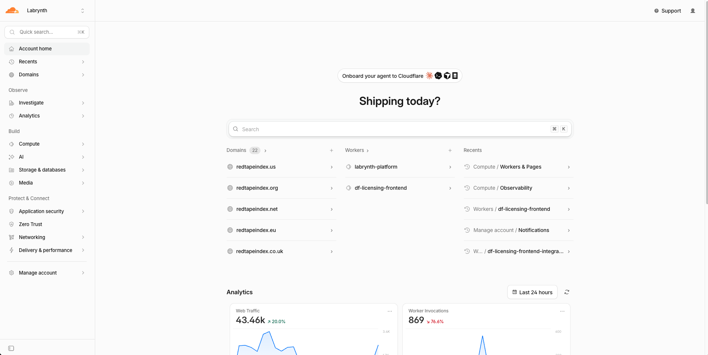
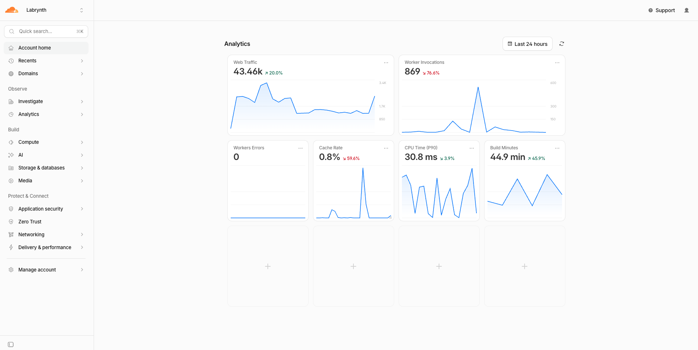

# Home / Launchpad — tela inicial unificada (busca + agentes + recentes + insights)

← [voltar ao índice](./README.md) · Status: **ideia registrada, NÃO implementar ainda** · 2026-07-16

Origem: Matheus quer uma tela inicial no estilo **Cloudflare "Account home"** — busca
central, recentes, páginas favoritas/principais, e (mais abaixo) insights/analytics.
E quer **fundir** isso com a página de Agentes (chat) que já existe, criando uma única
tela de entrada. Este doc guarda a ideia + análise de produto. Complementa
[PRODUCT_EXPERIENCE_MODULE.md](./PRODUCT_EXPERIENCE_MODULE.md) e
[VISAO_AGENTICA_PRODUTO.md](./VISAO_AGENTICA_PRODUTO.md).

## Referências visuais


*Cloudflare home: busca central (⌘K) + 3 colunas (Domains / Workers / Recents) + Analytics abaixo.*


*Mesma casa, seção de analytics: grid de tiles de métrica, cada card com sparkline + delta.*

---

## 1. O que a tela da Cloudflare realmente é

Não é um dashboard. É um **launchpad / command center** para quem volta todo dia e
precisa retomar o trabalho em 2 segundos. Tem duas zonas empilhadas, com respiro:

- **Zona de ação (topo):** busca (⌘K) como herói + colunas de "seus recursos"
  (Domains, Workers) + **Recents** (o que você tocou por último) + botões de criar (+).
- **Zona de observação (abaixo):** Analytics — grid de tiles, cada um com número
  grande, delta (↑20%) e sparkline. Cards vazios com "+" para o usuário montar.

O que faz funcionar: **zonas claras, hierarquia forte, muito espaço branco.** A busca
é a estrela; o resto é atalho pra pular de volta pro trabalho.

## 2. O que o Pilar já tem hoje (metade da ideia existe)

- **`src/pages/chat/` (Agentes):** chat-first. Estado vazio = saudação por horário +
  input herói + chips de sugestão agrupados por domínio (Financeiro, Projetos,
  Comercial). Orquestrador roteia p/ 3 agentes; cards de confirmação (draft não grava
  sem aprovação); saldo de créditos. **É conversacional, não é launchpad.**
- **`src/pages/Dashboard.tsx`:** home atual, orientada a métricas. **É a zona de
  observação da Cloudflare, já existe** (ainda que com dívida: full-scans P-1/P-2, bug
  do "A Receber" sem filtro de data).

Ou seja: você já tem a **zona de observação** (Dashboard) e já tem um **input de
agente** (chat). Falta o **wrapper de launchpad** que junta busca + recentes +
favoritos + atalhos, e a decisão de como as peças convivem.

## 3. A tese boa (e por que é diferenciada)

Na Cloudflare a busca é burra (só filtra recursos). No Pilar, **o input já é um agente
que entende linguagem natural e executa**. Então a fusão não é "colar chat numa home":
é transformar a busca do launchpad **no próprio agente**. A barra central faz as duas
coisas:

- **Navegar/buscar:** "faturas de junho", "projeto Construtora X" → pula pro registro.
- **Perguntar/agir:** "quanto recebi esse mês?", "cadastrar lead João" → orquestrador
  responde/cria (com card de confirmação).

Isso é genuinamente à frente do mercado: a maioria dos SaaS tem ⌘K (navegação) **e**
um chatbot em outro canto. Unificar os dois num só ponto de entrada é o movimento certo
e o Pilar já tem as duas metades construídas. Ver [VISAO_AGENTICA_PRODUTO.md](./VISAO_AGENTICA_PRODUTO.md).

## 4. Proposta concreta de layout (quando for a hora)

Home nova ("Início"), empilhada como a Cloudflare:

```
┌─────────────────────────────────────────────┐
│  Bom dia, Matheus                            │  ← saudação (já existe no chat)
│  ┌───────────────────────────────────────┐  │
│  │ 🔍 Pergunte, busque ou peça uma ação  │  │  ← AGENTE = busca (herói)
│  └───────────────────────────────────────┘  │
│  [chips de sugestão por domínio]             │  ← já existe no chat
├──────────────┬───────────────┬──────────────┤
│ Recentes     │ Fixados ⭐     │ Atalhos      │  ← 3 colunas (padrão CF)
│ • Projeto X  │ • Relatório Y  │ • Faturas    │
│ • Fatura #12 │ • Cliente Z    │ • Leads      │
├──────────────┴───────────────┴──────────────┤
│ Visão rápida  (3-4 tiles resumo, não full)   │  ← tira de insight compacta
│  [Lucro mês] [A receber] [Projetos ativos]   │     (link "ver tudo" → Insights)
└─────────────────────────────────────────────┘
```

- **Herói = input do agente** (reusa o que já está em `chat/`). Ao mandar, ou responde
  inline ou abre a conversa cheia. Navegação pura pode ficar num ⌘K separado se a
  ambiguidade "navegar vs perguntar" incomodar — mas o orquestrador já detecta intenção,
  então dá pra tentar um input só primeiro.
- **Recentes/Fixados:** precisa de tracking (tabela `user_recent_items` ou localStorage
  p/ MVP). Barato e reutilizável em todo o produto.
- **Tira de insight:** 3-4 tiles resumo reusando queries do `Dashboard.tsx`. Não a
  grade inteira.

## 5. Resposta à sua pergunta: onde colocam os insights?

Você perguntou se insight vira aba na sidebar, botão, ou seção tipo "uso" do Claude.
Regra de produto:

- **Item na sidebar** = coisa usada com frequência, parte do trabalho recorrente.
- **Botão/seção escondida (tipo "uso" do Claude)** = coisa consultada raramente.

Para o Pilar, "meu projeto está dando lucro?" **é a North Star** — insight não é raro,
é o coração. Então:

- **Recomendo:** item de topo na sidebar (**"Visão"** ou **"Insights"**) para o
  dashboard completo de métricas — que já é o `Dashboard.tsx`. **Não** enfiar em
  configurações.
- **E** uma **tira compacta** de 3-4 tiles no rodapé da Home (exatamente como a
  Cloudflare empilha Analytics embaixo do launchpad), com "ver tudo" levando à Visão.
- A home principal vira o **launchpad** (ação), não a grade de gráficos (observação).
  Hoje está invertido: o Dashboard de métricas é a primeira tela. A troca é: **ação em
  cima, observação embaixo/ao lado.**

## 6. Fluxo de upload → agente classifica (PARKED)

Matheus descreveu: usuário sobe arquivo → agentes identificam a que funcionalidade
pertence, ou o usuário escolhe → interação acontece dentro da própria home. **Para o
Pilar isso NÃO existe ainda** (o próprio Matheus disse que não vai ter upload agora).
Guardar como extensão futura: é um bom padrão (drop zone que roteia por conteúdo), mas
prematuro. Só faz sentido quando houver um caso de upload real no produto.

## 7. Riscos / armadilhas

- **Sequenciamento:** não reconstruir a home antes do 1º cliente pagante. É refação de
  navegação, alto esforço, baixo impacto na primeira venda. Ver [DISCUSSAO_TIME_2026-07-14.md](./DISCUSSAO_TIME_2026-07-14.md).
- **Não empilhar tudo numa tela só** até virar bagunça. A tela da CF funciona por zonas
  claras e respiro. Fundir busca+chat+recentes+favoritos+insights sem hierarquia = ruído.
- **Ambiguidade navegar vs perguntar** num input único tem custo cognitivo. Testar; se
  atrapalhar, separar ⌘K (navegação) do input do agente (perguntar/agir).
- **Tiles de insight reusam queries do Dashboard** — atenção à dívida já mapeada
  (full-scans P-1/P-2, bug "A Receber" sem filtro de data). Não propagar o bug pra home.
- **Recents/favoritos = infra nova** (pequena, mas nova tabela + RLS). Vale porque é
  reutilizável em todo o produto, não só na home.

## 8. Sequência sugerida (quando priorizar)

1. Gatilho: pós-1º pagante, quando "retomar trabalho rápido" virar dor real de uso.
2. MVP: shell de launchpad reusando o input do agente (já pronto) + Recentes via
   localStorage + Atalhos estáticos. Insights fica como está (`Dashboard.tsx`), só
   renomeia/move pra sidebar como "Visão".
3. V2: Fixados (tabela + RLS), tira de insight compacta na home, tracking de recentes
   no banco (multi-device).
4. Futuro: upload → roteamento por agente (só quando existir upload no produto).

## 9. Veredito de uma linha

Ideia forte e diferenciada (o agente **é** a busca), e você já tem as duas metades
construídas — mas é refação de navegação: guardar o layout, mover insights pra sidebar
como "Visão", e só construir o launchpad depois do primeiro cliente pagando.
